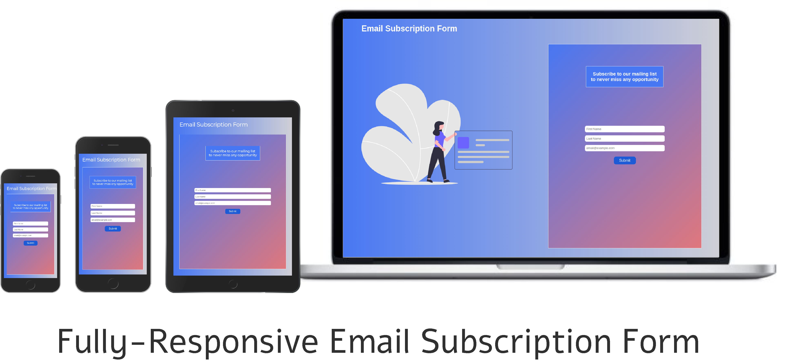

# Email Subscription Page

## Introduction
This is a fully-responsive Email subscription Landing page. The form has frontend part in this repository. The backend can be added in a similar manner as the Repository which sends an email using NodeMailer.

You can enter your Name, surname and email and request to be added to the mailing list. As soon as you click the submit button, a request is made to send a confirmation email to the email address you provided using the NodeMailer package and ethereal fake email SMTP configuration. The purpose of using ethereal is to show a working demonstration of the project and spare the official email account from getting banned.

## How Do I edit it?
To edit the design, all you need to do is open the project in some text editor, preferrably some IDE like VS Code. To change the color scheme, you only need to change the values of the variables in the :root{} element of the style.css file.